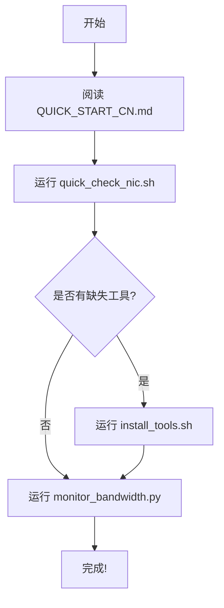

# 📑 CX7 网卡带宽查询工具集 - 索引

**版本**: 1.0
**更新时间**: 2025-11-26
**适用于**: NVIDIA ConnectX-7 (CX7) 网卡及其他高性能网卡

---

## 🎯 工具概览

本工具集提供了一套完整的解决方案，用于在 Linux 系统上查询和监控 NVIDIA ConnectX-7 网卡的带宽信息。

### 核心特性

✅ **零依赖检测** - 基础功能无需额外工具
✅ **实时监控** - 持续跟踪网络带宽使用情况
✅ **自动诊断** - 智能检测缺失的工具并提供安装建议
✅ **详细文档** - 包含完整的操作指南和故障排查
✅ **跨发行版** - 支持 Debian/Ubuntu 和 RHEL/CentOS 系列

---

## 📂 文件列表

### 🔧 可执行脚本

| 文件名 | 功能 | 语言 | 运行命令 |
|--------|------|------|----------|
| `quick_check_nic.sh` | 快速检查网卡状态 | Bash | `./quick_check_nic.sh` |
| `check_nic_bandwidth.py` | 完整的网卡信息检测 | Python | `python3 check_nic_bandwidth.py` |
| `monitor_bandwidth.py` | 实时带宽监控工具 | Python | `python3 monitor_bandwidth.py eth0` |
| `install_tools.sh` | 自动安装必要工具 | Bash | `sudo ./install_tools.sh` |
| `test_all_tools.sh` | 测试所有工具 | Bash | `./test_all_tools.sh` |

### 📚 文档文件

| 文件名 | 内容 | 推荐场景 |
|--------|------|----------|
| `QUICK_START_CN.md` | 快速入门指南（中文） | 新用户首选 |
| `README_NIC_BANDWIDTH.md` | 完整说明文档 | 全面了解工具 |
| `CX7_NIC_BANDWIDTH_GUIDE.md` | 详细操作和参考 | 高级用户和故障排查 |
| `NIC_TOOLS_INDEX.md` | 本文件 - 工具集索引 | 快速查找文件 |

---

## 🚀 快速开始流程

### 新用户推荐路径



### 三步快速上手

#### 步骤 1: 初次诊断
```bash
cd /workspace
./quick_check_nic.sh
```

#### 步骤 2: 安装工具（如需要）
```bash
sudo ./install_tools.sh
# 选择选项 4（安装所有工具）
```

#### 步骤 3: 开始监控
```bash
# 列出接口
python3 monitor_bandwidth.py -l

# 监控指定接口
python3 monitor_bandwidth.py eth0
```

---

## 📖 使用场景指南

### 场景 1: 我是新用户，不知道从哪开始
**推荐文档**: `QUICK_START_CN.md`
**推荐工具**: `quick_check_nic.sh`

```bash
# 阅读快速入门
cat QUICK_START_CN.md

# 运行快速检查
./quick_check_nic.sh
```

### 场景 2: 我想快速查看网卡速率
**推荐工具**: 系统命令或 `quick_check_nic.sh`

```bash
# 方法 1: 使用系统文件
cat /sys/class/net/eth0/speed

# 方法 2: 运行快速检查
./quick_check_nic.sh

# 方法 3: 使用 ethtool（如已安装）
ethtool eth0 | grep Speed
```

### 场景 3: 我需要实时监控带宽
**推荐工具**: `monitor_bandwidth.py`

```bash
# 基础监控（Gbps）
python3 monitor_bandwidth.py eth0

# 详细监控（包含包速率和错误）
python3 monitor_bandwidth.py eth0 -p -e

# 使用 Mbps 单位
python3 monitor_bandwidth.py eth0 -u mbps
```

### 场景 4: 我需要完整的诊断报告
**推荐工具**: `check_nic_bandwidth.py`

```bash
python3 check_nic_bandwidth.py
```

### 场景 5: 系统缺少必要工具
**推荐工具**: `install_tools.sh`

```bash
sudo ./install_tools.sh
# 选择合适的安装选项
```

### 场景 6: 我需要详细的配置和优化指南
**推荐文档**: `CX7_NIC_BANDWIDTH_GUIDE.md`

```bash
# 查看完整指南
less CX7_NIC_BANDWIDTH_GUIDE.md

# 或使用文本编辑器
vim CX7_NIC_BANDWIDTH_GUIDE.md
```

### 场景 7: 性能测试和基准测试
**推荐文档**: `README_NIC_BANDWIDTH.md` 性能监控部分

```bash
# 使用 iperf3 测试
# 服务端
iperf3 -s

# 客户端（另一台机器）
iperf3 -c <server_ip> -t 60 -P 10

# 同时监控带宽
python3 monitor_bandwidth.py eth0
```

---

## 🔍 工具详细说明

### 1. quick_check_nic.sh

**用途**: 快速系统检查
**特点**:
- ✓ 无需额外依赖
- ✓ 彩色输出
- ✓ 自动检测工具
- ✓ 提供安装建议

**输出内容**:
- 可用网络接口列表
- 接口详细信息（速率、MTU、状态等）
- 已安装/缺失的工具
- PCI 设备信息
- InfiniBand 设备信息
- 当前流量统计
- 针对 CX7 的推荐

**运行示例**:
```bash
./quick_check_nic.sh
```

### 2. check_nic_bandwidth.py

**用途**: 完整的网卡信息检测
**特点**:
- ✓ Python 实现
- ✓ 结构化输出
- ✓ 多种检测方法
- ✓ 详细错误提示

**检测内容**:
- /sys/class/net/ 信息
- ethtool 信息（如可用）
- lspci 信息（如可用）
- InfiniBand 信息（如可用）
- Mellanox 专用工具检测

**运行示例**:
```bash
python3 check_nic_bandwidth.py
```

### 3. monitor_bandwidth.py

**用途**: 实时带宽监控
**特点**:
- ✓ 实时更新
- ✓ 多种显示模式
- ✓ 可配置采样间隔
- ✓ 累计统计

**参数说明**:
```bash
# 查看帮助
python3 monitor_bandwidth.py -h

# 列出接口
python3 monitor_bandwidth.py -l

# 基础监控
python3 monitor_bandwidth.py eth0

# 采样间隔 0.5 秒
python3 monitor_bandwidth.py eth0 -i 0.5

# 使用 Mbps
python3 monitor_bandwidth.py eth0 -u mbps

# 显示包速率
python3 monitor_bandwidth.py eth0 -p

# 显示错误统计
python3 monitor_bandwidth.py eth0 -e

# 组合使用
python3 monitor_bandwidth.py eth0 -u mbps -i 0.5 -p -e
```

**输出示例**:
```
Time            RX Rate      TX Rate        Total
------------------------------------------------------------
14:30:01           2.34 Gb/s     1.56 Gb/s     3.90 Gb/s
14:30:02           5.67 Gb/s     3.21 Gb/s     8.88 Gb/s
```

### 4. install_tools.sh

**用途**: 自动安装必要工具
**特点**:
- ✓ 支持多种 Linux 发行版
- ✓ 交互式安装
- ✓ 自动检测系统类型
- ✓ 提供 MLNX_OFED 和 MFT 信息

**安装选项**:
1. 基础网络工具（ethtool, lspci, iproute2）
2. 基础 + InfiniBand 工具
3. 基础 + InfiniBand + 监控工具
4. 全部安装（推荐）
5. 仅显示 MLNX_OFED 和 MFT 信息

**运行示例**:
```bash
sudo ./install_tools.sh
```

### 5. test_all_tools.sh

**用途**: 测试所有工具是否正常工作
**特点**:
- ✓ 快速验证
- ✓ 检查文件完整性
- ✓ 测试基本功能

**运行示例**:
```bash
./test_all_tools.sh
```

---

## 📚 文档指南

### QUICK_START_CN.md
**适合**: 新用户、快速上手
**内容**:
- 三步快速开始
- 常用命令示例
- 不同场景的使用方法
- 输出结果解读
- 常见问题解决

### README_NIC_BANDWIDTH.md
**适合**: 全面了解工具集
**内容**:
- 完整的工具说明
- 所有功能介绍
- 安装指南
- 使用示例
- CX7 规格参考
- FAQ

### CX7_NIC_BANDWIDTH_GUIDE.md
**适合**: 高级用户、系统管理员
**内容**:
- 所有可用命令详解
- 工具安装方法
- 配置优化建议
- 性能调优
- 故障排查流程
- 高级工具使用
- 最佳实践

---

## 🛠️ 系统要求

### 最低要求
- Linux 操作系统（内核 3.10+）
- Python 3.6+
- Bash 4.0+

### 推荐配置
- Linux 操作系统（内核 5.0+）
- Python 3.8+
- 已安装基础网络工具

### 可选工具
- ethtool - 以太网配置工具
- lspci - PCI 设备查看
- iproute2 - 网络配置
- infiniband-diags - InfiniBand 诊断
- libibverbs - InfiniBand 开发库
- iftop/nload - 流量监控
- iperf3 - 性能测试
- MLNX_OFED - Mellanox 驱动（推荐）
- MFT - Mellanox 固件工具（可选）

---

## 🔗 快速命令参考卡

### 检测和诊断
```bash
./quick_check_nic.sh                    # 快速检查
python3 check_nic_bandwidth.py          # 完整检测
./test_all_tools.sh                     # 测试工具
```

### 查看速率
```bash
cat /sys/class/net/eth0/speed           # 系统文件
ethtool eth0 | grep Speed               # ethtool
ibstat | grep Rate                      # InfiniBand
```

### 实时监控
```bash
python3 monitor_bandwidth.py -l         # 列出接口
python3 monitor_bandwidth.py eth0       # 监控 eth0
python3 monitor_bandwidth.py eth0 -p -e # 详细模式
```

### 工具管理
```bash
sudo ./install_tools.sh                 # 安装工具
python3 monitor_bandwidth.py -h         # 查看帮助
```

### 文档查看
```bash
cat QUICK_START_CN.md                   # 快速开始
less README_NIC_BANDWIDTH.md            # 完整文档
vim CX7_NIC_BANDWIDTH_GUIDE.md          # 详细指南
```

---

## 📊 CX7 规格速查

### 支持的速率
- **InfiniBand NDR**: 400 Gbps
- **InfiniBand HDR**: 200 Gbps
- **InfiniBand EDR**: 100 Gbps
- **Ethernet**: 400GbE / 200GbE / 100GbE

### PCIe 接口
- **标准**: PCIe Gen5 x16
- **带宽**: 128 GB/s（双向）

### 单位转换
- 1 Gbps = 1,000 Mbps = 125 MB/s
- 100 Gbps = 100,000 Mbps = 12.5 GB/s
- 200 Gbps = 200,000 Mbps = 25 GB/s
- 400 Gbps = 400,000 Mbps = 50 GB/s

---

## ❓ 常见问题

### Q: 从哪个文件开始？
A: 建议先阅读 `QUICK_START_CN.md`，然后运行 `./quick_check_nic.sh`

### Q: 如何知道需要安装哪些工具？
A: 运行 `./quick_check_nic.sh`，它会告诉你缺少哪些工具

### Q: 实时监控工具如何停止？
A: 按 `Ctrl+C` 停止，会显示累计统计信息

### Q: 速率显示为 Unknown 怎么办？
A: 可能是虚拟接口或未连接。使用 `ethtool` 或 `mlxlink` 查看物理接口

### Q: 如何进行性能测试？
A: 使用 `iperf3` 配合 `monitor_bandwidth.py` 实时监控

---

## 🔄 更新历史

**v1.0** (2025-11-26)
- ✨ 初始版本发布
- ✨ 包含所有核心工具
- ✨ 完整的中文文档
- ✨ 支持多种 Linux 发行版

---

## 📞 获取帮助

### 工具问题
- 查看工具帮助: `python3 monitor_bandwidth.py -h`
- 运行测试: `./test_all_tools.sh`

### 网卡问题
- 参考故障排查: `CX7_NIC_BANDWIDTH_GUIDE.md`
- 查看系统日志: `dmesg | grep mlx5`

### 文档
- 快速入门: `QUICK_START_CN.md`
- 完整文档: `README_NIC_BANDWIDTH.md`
- 详细指南: `CX7_NIC_BANDWIDTH_GUIDE.md`

---

## 🎓 学习路径

### 初级用户
1. 阅读 `QUICK_START_CN.md`
2. 运行 `./quick_check_nic.sh`
3. 尝试 `monitor_bandwidth.py`

### 中级用户
1. 完整阅读 `README_NIC_BANDWIDTH.md`
2. 使用所有工具
3. 进行性能测试

### 高级用户
1. 深入阅读 `CX7_NIC_BANDWIDTH_GUIDE.md`
2. 安装 MLNX_OFED 和 MFT
3. 进行系统调优
4. 使用高级工具（mlxlink, mlxconfig）

---

**工具集版本**: 1.0
**最后更新**: 2025-11-26
**支持平台**: Linux (Debian/Ubuntu/RHEL/CentOS)
**目标硬件**: NVIDIA ConnectX-7 及其他高性能网卡
